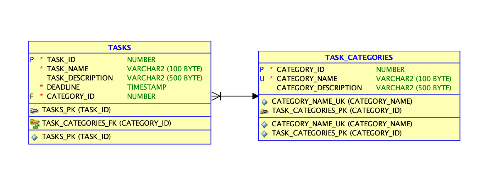

# Todo App

## Initial Problem

This is a skeleton of Spring Boot application which should be used as a start point to create a working one.
The goal of this task is to create simple REST API  which allows users to manage TODOs. 
The API should allow to create/delete/update TODOs and categories as well as search for user, name, description, deadline and category in any combination. *For example find all todos for an user X where deadline is today and name contains test.* 
The API should also implement basic authorization/authentication: *User X cannot access TODOs of user Y as long as he doesn't have admin role.*

You are free to use any library or testing framework in the project.

Below you may find a proposition of the DB model:

Once you are ready, please send me **link to your git repository** which contains complete solution

## Result

### Description

This todo-app API implements CRUD operations on Todos,
Categories and Users as described by the [swagger file](src/main/resources/static/swagger.yml).

Once the application is running, swagger is accessible at path `/swagger-ui/index.html`
( Default should be `http://localhost:8080/swagger-ui/index.html` )

The service was developed contract-first, meaning the swagger mentioned above is used for input model class generation,
forcing it that way to be up to date with exposed swagger.

I followed the architecture : **Controller** - **Service** - **Repository** - **Database**

Database was left as initially suggested in an h2 file database ignored from VCS,
provisioning scripts can be found in [test resources ](./src/test/resources/scripts/setup_test_database.sql)

### Get Started

- **Copy** `src/main/resources/application-local.example.yml` to `src/main/resources/application-local.yml` and replace secrets
- **Windows** : `.\gradlew.bat clean build`
- **Linux** : `./gradle clean build`
- Run the application with *local* spring profile : ``java -jar -Dspring.profiles.active=local build/libs/tobo-1.0.0-SNAPSHOT.jar``

### CI/CD

Pushes on main branch trigger a Github workflow which builds and test app and send sonarqube report and Jacoco repôrt to sonarcloud.
A docker container is built and pushed to tdonnenfeld/todo-app on docker.io container registry.

Report available [Sonarcloud](https://sonarcloud.io/project/overview?id=t-donnenfeld_todo-app)

Application is deployed [here](https://todo.les12.fr/swagger-ui/index.html)

### Simplification choices

- For the sake of simplicity users are authenticated with Basic Auth on this application.
- Timezones are not handled
- CSRF checks are Disabled
- Can only create users with role USER ( no admins )
- Update endpoints are using replace pattern, not json-patch
- Endpoints might deliver too much information to users 

### Issues encountered

- Gradle management of java modules : cleanly adding generated sources
- Conflict of slf4j implementation : `org.openapitools:openapi-generator` transitively imported `slf4j.simple` which implements SLF4JServiceProvider and collided with default spring-boot-starter-logging SLF4JServiceProvider
- Cascading of deletions ( remove todos categoryId FK when category is deleted )

### Versions

- 1.1.0: Major bug fix on delete category
- 1.0.1: Minor swagger fixes and added CI/CD
- 1.0.0: First draft of working and tested application

### Improvements TODO

- De-couple basic auth from integration tests
- Switch application authentication to OAuth
- Security on categories ? Any user can currently delete any category